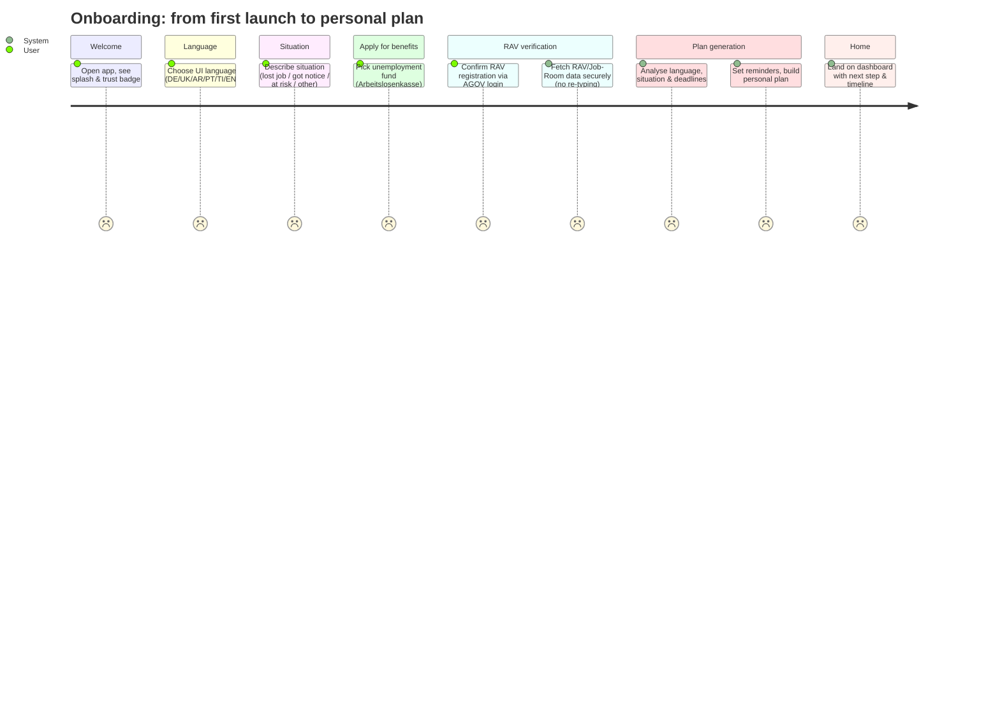
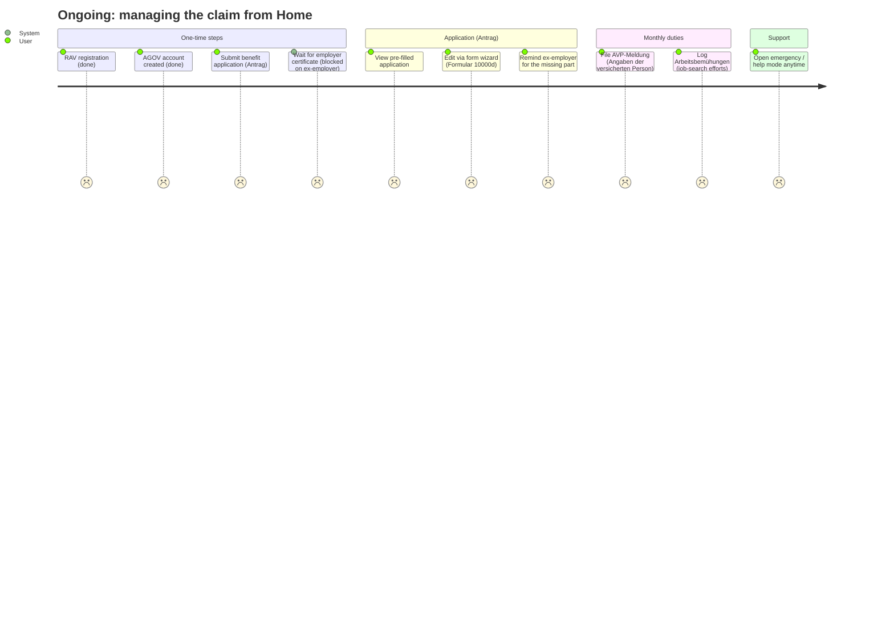
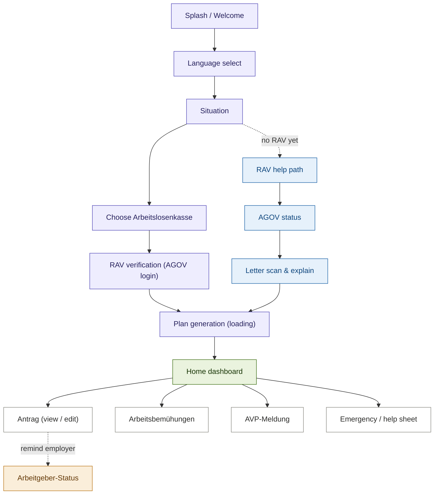

# Freddy's Companion / Digital Companion for Unemployment

**Freddy's Companion** is a GovTech Hackathon 2026 prototype: a plain-language companion that
guides a person through the Swiss unemployment journey - from the first letter from the RAV
to the first payout.

> [!NOTE]
> This is an **MVP built for demo purposes only** — a clickable prototype to illustrate the
> flow and user experience, not a production-ready application.

----

### User Story – Onboarding

The linear flow a new user walks through, from launch to a personal plan.

----

### User Story – Ongoing tasks (Home dashboard)

After onboarding the user lives on the Home screen, which separates **one-time** from
**monthly** obligations and surfaces blockers.

----

### Screen flow

`index.html` is a client-side single-page app: every screen is toggled by `goToView()` and
the `open*()` helpers. There is no router and no server.

> Demo persona: **Freddy Fremd**, Personennummer `12345678`, **RAV Bern** — the ex-employer's
> certificate is overdue, so the application is blocked until it arrives.
