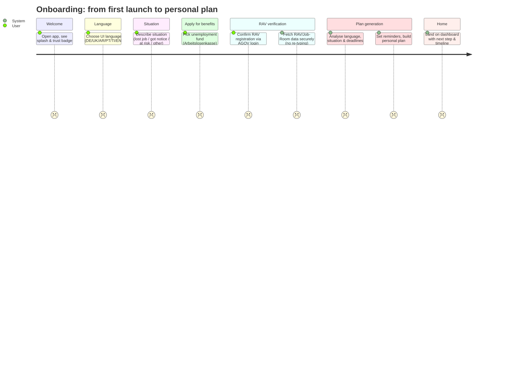
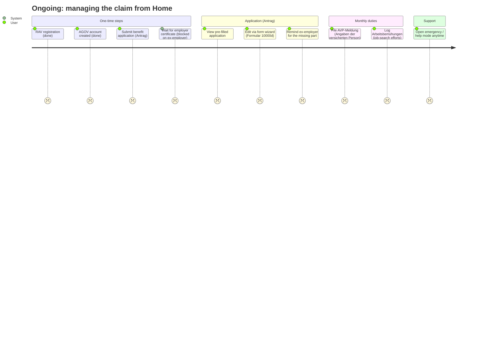
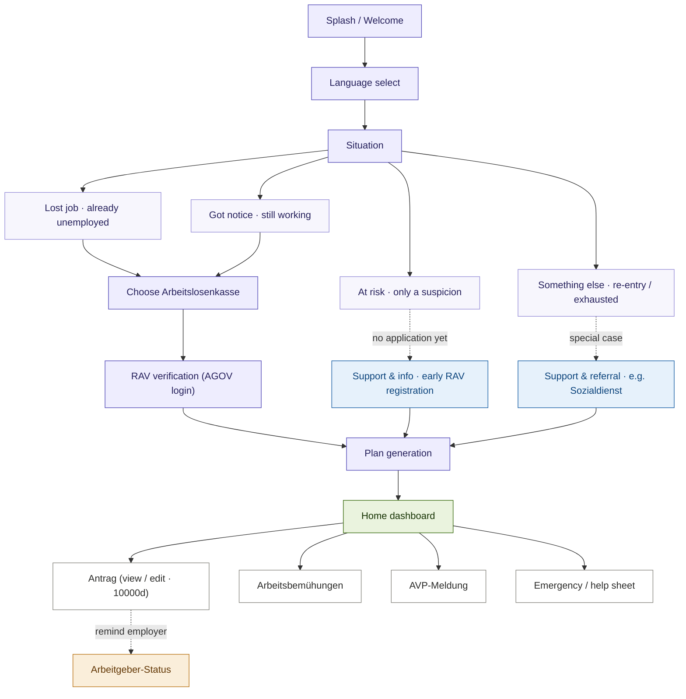

# Freddy's Companion / Digital Companion for Unemployment

**Freddy's Companion** is a GovTech Hackathon 2026 prototype: a plain-language companion that
guides a person through the Swiss unemployment journey - from the first letter from the RAV
to the first payout.

🔗 **GovTech page:** https://www.bk.admin.ch/de/govtechhackathon26

🔗 **Project page:** https://govtech.digisus-lab.ch/project/36

---

> [!NOTE]
> This is an **MVP built for demo purposes only** - a clickable prototype to illustrate the
> flow and user experience, not a production-ready application.

----

### User Story – Onboarding

The linear flow a new user walks through, from launch to a personal plan.

----

### User Story – Ongoing tasks (Home dashboard)

After onboarding the user lives on the Home screen, which separates **one-time** from
**monthly** obligations and surfaces blockers.

----

### Screen flow

These situations and their paths are designed for the demo. The branching shown here illustrates the intended logic — a production implementation would differ, with real eligibility rules and support routes defined together with the responsible authorities.

> Demo persona: **Freddy Fremd**, Personennummer `12345678`, **RAV Bern** — the ex-employer's
> certificate is overdue, so the application is blocked until it arrives.
